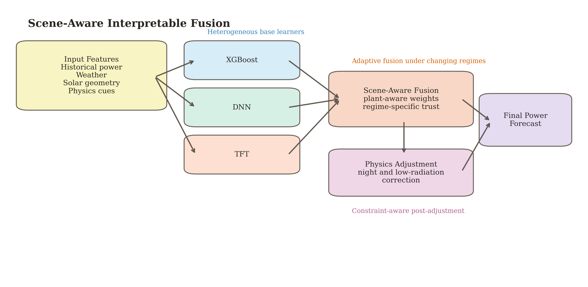
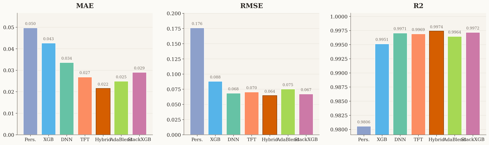
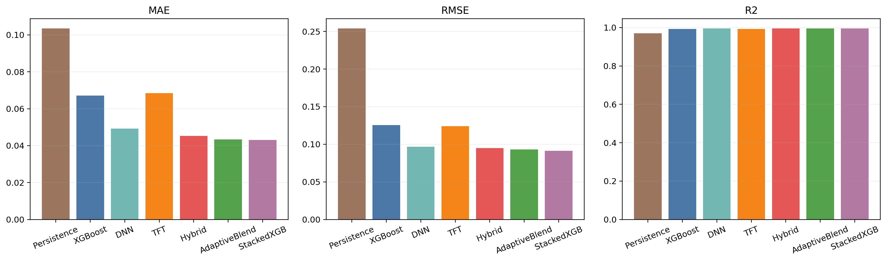
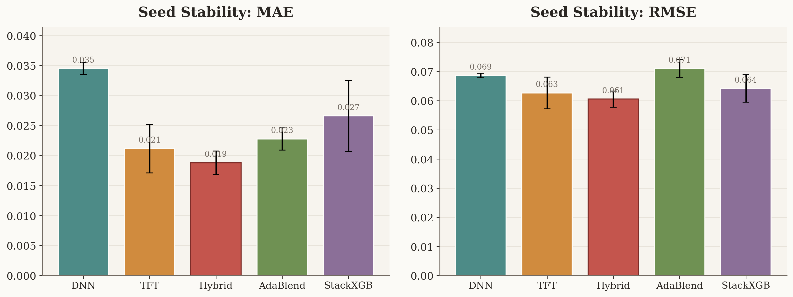
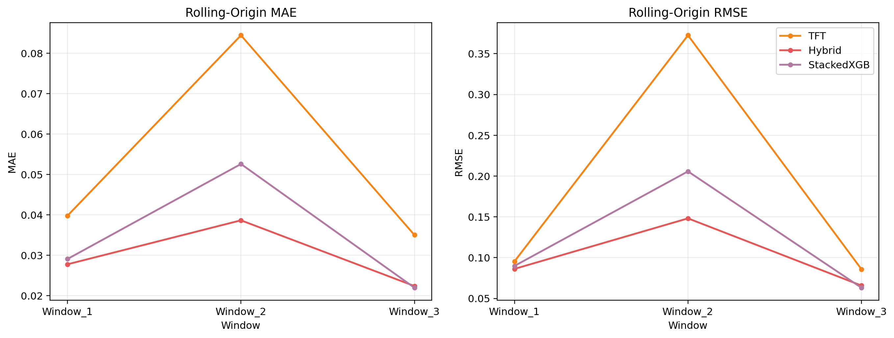

# Scene-Aware PV Power Forecasting

This repository is a research codebase for `5-minute-ahead` photovoltaic power forecasting on four heterogeneous PV assets at the Alice Springs site. The current project focus is not only forecasting accuracy, but also how to organize heterogeneous base learners, how to evaluate them under stricter temporal protocols, and how to add a lightweight constraint-aware view through physical violation checks.

`Hybrid` is the main method in this repository. It combines `XGBoost`, `DNN`, and `TFT` through scene-aware and plant-aware weighting, then applies a lightweight physics-guided post-adjustment on low-irradiance and nighttime samples.

<p align="center">
  
</p>
<p align="center">
  Standardized features, heterogeneous base learners, scene-aware fusion, and constraint-aware evaluation.
</p>

## Overview

- Research question: how to perform structured and interpretable model fusion on heterogeneous PV time series with known next-step weather.
- Main method: `Hybrid`, a scene-aware interpretable fusion model over `XGBoost`, `DNN`, and `TFT`.
- Evaluation emphasis: chronological split, split gap, `daytime-only`, multi-seed, `rolling-origin`, and physical violation rate.
- Current role of baselines: `TFT` is the stronger deep temporal baseline after the higher training budget; `StackedXGB` is a meta-learning comparison rather than the main story.

## Problem Setup

| Item | Value |
| --- | --- |
| Site | Alice Springs, Australia |
| Assets | 4 heterogeneous PV assets |
| Data files | `dataset/data_1A.csv`, `dataset/data_1C.csv`, `dataset/data_3A.csv`, `dataset/data_4A.csv` |
| Time span | `2013-04-23 08:35:00` to `2016-10-21 15:05:00` |
| Resolution | `5 min` |
| Task | Next-step power regression under known next-step weather |
| Raw samples | `1,242,372` |
| Supervised samples | `1,241,216` |
| Continuous features | `96` |
| Encoded features | `111` |
| Main metrics | `MAE`, `RMSE`, `R2`, physical violation rates |

## Why This Repository Fits SDM

- The data object is a heterogeneous multivariate time series rather than a single homogeneous forecast stream.
- The method focus is structured model selection and fusion under changing regimes, not only pure black-box regression.
- The evaluation protocol goes beyond one fixed split and adds `daytime-only`, multi-seed, and rolling-origin checks.
- The repository reports physical violation rate, so the comparison is not limited to pointwise error.

## Main Results

### Fixed-Split Results

| Model | MAE | RMSE | R2 |
| --- | ---: | ---: | ---: |
| Persistence | 0.049670 | 0.175950 | 0.980560 |
| XGBoost | 0.042605 | 0.087974 | 0.995140 |
| DNN | 0.033542 | 0.068490 | 0.997054 |
| TFT | 0.026838 | 0.070332 | 0.996894 |
| Hybrid | 0.021530 | 0.064468 | 0.997390 |
| AdaptiveBlend | 0.024887 | 0.075229 | 0.996446 |
| StackedXGB | 0.029018 | 0.067131 | 0.997170 |

### Robustness Summary

| Setting | TFT | Hybrid | StackedXGB |
| --- | ---: | ---: | ---: |
| Fixed split MAE | 0.026838 | 0.021530 | 0.029018 |
| Daytime-only MAE | 0.053429 | 0.043451 | 0.052496 |
| Multi-seed MAE | 0.021144 +/- 0.004029 | 0.018796 +/- 0.001966 | 0.026599 +/- 0.005934 |
| Rolling-origin MAE | 0.033845 +/- 0.008390 | 0.027830 +/- 0.006528 | 0.034299 +/- 0.008551 |

### Constraint-Aware Evaluation

| Model | PhysicalViolationRate | NegativeRate | NightPositiveRateOnNight |
| --- | ---: | ---: | ---: |
| Hybrid | 0.000508 | 0.000492 | 0.000031 |
| TFT | 0.000008 | 0.000008 | 0.000000 |
| StackedXGB | 0.000016 | 0.000000 | 0.000031 |
| DNN | 0.099240 | 0.099192 | 0.000093 |

Current takeaway:

- `Hybrid` is the strongest overall method under the current fixed split, daytime-only split, multi-seed summary, and rolling-origin summary.
- `TFT` becomes materially stronger after the higher training budget, so the current comparison is more credible than the earlier exploratory version.
- `Hybrid` is not the absolute best physical-consistency model, but it keeps violation rates low while delivering the best overall accuracy.

## Training Budget

| Model | Max epochs / rounds | Batch size | Early stop / patience | Notes |
| --- | ---: | ---: | ---: | --- |
| XGBoost | 300 | - | 30 | validation RMSE early stopping |
| DNN | 30 | 8192 | 5 | best-state restore |
| TFT | 30 | 6144 | 5 | 24-step encoder, hidden size 16, 2 heads, `bf16-mixed`, best checkpoint restore |
| AdaptiveBlend | 30 | 16384 | 6 | validation-holdout MAE selection |
| StackedXGB | 600 | - | 50 | validation-holdout RMSE early stopping |

The exported training budget and actual executed epochs or rounds are stored in:

- `artifacts/metrics/training_configuration.csv`
- `artifacts/metrics/training_execution_summary.csv`

For release reproducibility, the project now enables deterministic training mode by default, uses single-worker data loading in reproducibility mode, and records a published results signature in `artifacts/checks/published_results_manifest.json`.

## Data Schema

All dataset files use English column names:

| Column | Description |
| --- | --- |
| `timestamp` | observation timestamp |
| `plant_id` | asset identifier |
| `irradiance` | irradiance-related sensor input |
| `temperature` | ambient or module temperature signal |
| `humidity` | humidity signal |
| `wind_speed` | wind speed signal |
| `direct_radiation` | direct radiation |
| `global_radiation` | global radiation |
| `power` | target PV output |

The current task formulation explicitly assumes that the next-step weather is known. This repository therefore solves conditional next-step power regression rather than pure weather-free forecasting.

## Dataset Release

The raw CSV files are not stored directly in Git history. GitHub keeps compressed split parts in `dataset_parts/`, together with restore scripts.

Restore the raw dataset locally:

```powershell
.\.venv\Scripts\python tools\merge_dataset_parts.py --overwrite
```

Rebuild split parts from local raw CSV files:

```powershell
.\.venv\Scripts\python tools\split_dataset_parts.py
```

## Evaluation Protocol

| Component | Setting |
| --- | --- |
| Main split | per-asset chronological `80 / 10 / 10` |
| Split gap | `72` steps between train-val and val-test, about `6 hours` |
| Daytime-only | filter with `forecast_night_flag == 0`, ratio about `47.93%` |
| Multi-seed | `42`, `52`, `62` |
| Rolling-origin windows | `60/70/80`, `70/80/90`, `80/90/100` |
| Stored metrics | `MAE`, `RMSE`, `MAPE`, `sMAPE`, `R2`, `Bias`, `Samples`, physical violation rates |

`MAPE` is exported for completeness, but `MAE`, `RMSE`, and `R2` remain the primary metrics because nighttime power is often close to zero.

## Figures

<table>
  <tr>
    <td></td>
    <td></td>
  </tr>
  <tr>
    <td align="center">Fixed-split comparison</td>
    <td align="center">Daytime-only comparison</td>
  </tr>
  <tr>
    <td></td>
    <td></td>
  </tr>
  <tr>
    <td align="center">Multi-seed stability</td>
    <td align="center">Rolling-origin evaluation</td>
  </tr>
</table>

## Repository Layout

```text
.
|-- dataset/                 # normalized CSV files
|-- dataset_parts/           # compressed dataset release parts for GitHub
|-- pvbench/
|   |-- config.py            # experiment configuration
|   |-- data.py              # loading, normalization, feature engineering, splits
|   |-- models.py            # baselines, Hybrid, AdaptiveBlend, StackedXGB
|   `-- reporting.py         # metrics, plots, physical violation evaluation
|-- tools/
|   |-- split_dataset_parts.py
|   |-- merge_dataset_parts.py
|   |-- reproducibility.py
|   |-- reproduce_release.py
|   |-- staged_runner.py
|   |-- write_reports.py
|   |-- generate_paper_figures.py
|   `-- verify_project.py
|-- artifacts/
|   |-- metrics/
|   |-- plots/
|   |-- paper_figures/
|   |-- reports/
|   `-- checks/
|-- run_experiments.py       # end-to-end experiment entry
`-- requirements.txt
```

## Quick Start

### 1. Create the environment

```powershell
py -3.12 -m venv .venv
.\.venv\Scripts\python -m pip install --upgrade pip
.\.venv\Scripts\python -m pip install -r requirements.txt --extra-index-url https://download.pytorch.org/whl/cu128
```

### 2. Run the main experiment

```powershell
.\.venv\Scripts\python run_experiments.py
```

Long-running stages can also be refreshed separately:

```powershell
.\.venv\Scripts\python tools\staged_runner.py main
.\.venv\Scripts\python tools\staged_runner.py rolling-window --index 1
.\.venv\Scripts\python tools\staged_runner.py rolling-window --index 2
.\.venv\Scripts\python tools\staged_runner.py rolling-window --index 3
```

### 3. Cleanly reproduce the published release

```powershell
.\.venv\Scripts\python tools\reproduce_release.py
```

This command restores the dataset from `dataset_parts/` if needed, clears stale release outputs, reruns the staged experiment pipeline, regenerates reports and figures, and compares the resulting files against `artifacts/checks/published_results_manifest.json`.

### 4. Rebuild reports and paper figures

```powershell
.\.venv\Scripts\python tools\write_reports.py
.\.venv\Scripts\python tools\generate_paper_figures.py
```

### 5. Verify generated artifacts

```powershell
.\.venv\Scripts\python tools\verify_project.py
```

## Generated Artifacts

| Path | Description |
| --- | --- |
| `artifacts/metrics/` | fixed-split tables, daytime metrics, physical violation metrics, ablations, multi-seed summaries, rolling-origin summaries, training budget tables, predictions |
| `artifacts/plots/` | general experiment plots |
| `artifacts/paper_figures/` | paper-ready figures |
| `artifacts/reports/` | Chinese training setup, result summary, robustness summary, SDM positioning notes, paper-style draft |
| `artifacts/checks/` | project verification outputs |

## Reproducibility Notes

- Verified environment: `Python 3.12`, CUDA available, GPU PyTorch runtime
- Main entry: `run_experiments.py`
- Staged reruns: `tools/staged_runner.py`
- Release reproduction: `tools/reproduce_release.py`
- Report regeneration: `tools/write_reports.py`
- Project verification: `tools/verify_project.py`
- `tools/verify_project.py` now checks both dataset hashes against `dataset_parts/manifest.json` and result hashes against `artifacts/checks/published_results_manifest.json`
- The current README reflects the latest generated artifacts in `artifacts/`
